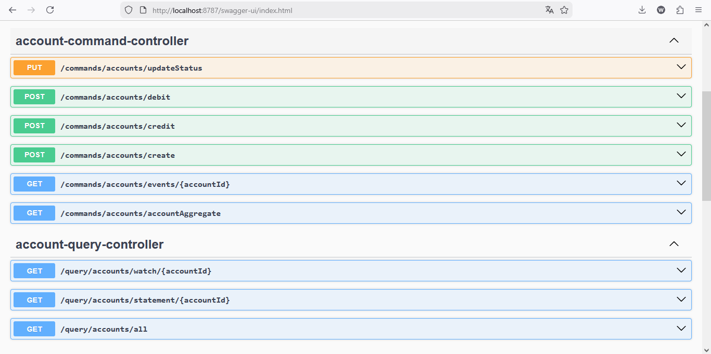
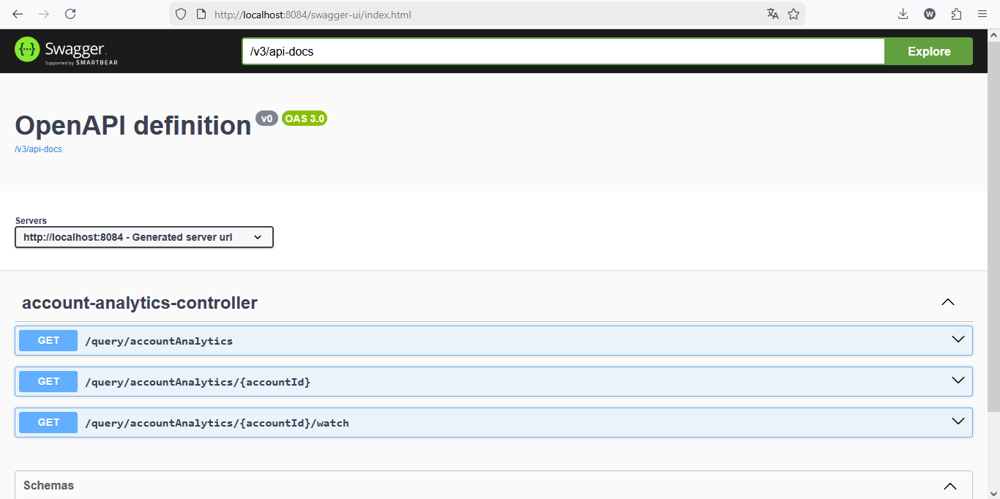

# Projet CQRS avec Axon Framework et PostgreSQL

## Vue d'ensemble

Ce projet implémente une architecture **CQRS (Command Query Responsibility Segregation)** utilisant le framework **Axon Framework** avec **PostgreSQL** comme base de données et **Axon Server** comme gestionnaire d'événements.

L'application est composée de deux services principaux :
- **CQRS Axon Service** : Service principal gérant les commandes et les requêtes
- **Analytics Service** : Service analytique pour la génération de rapports et statistiques

---

##  API




### Diagramme des flux de données



---

##  Services

### 1. Service CQRS Axon (Port 8080)

**Description** : Service principal implémentant le pattern CQRS avec Axon Framework.

**Caractéristiques** :
- Gestion des commandes (Commands) pour les opérations d'écriture
- Gestion des requêtes (Queries) pour les opérations de lecture
- Agrégats pour la gestion d'état des comptes
- Événements pour tracer toutes les modifications

**Structure du code** :
```
src/main/java/org/example/cqrsaxon/
├── command/
│   ├── aggregates/        # Agrégats Axon
│   ├── commands/          # Définitions des commandes
│   └── controllers/       # Contrôleurs des commandes
├── commons/
│   ├── dtos/             # Objets de transfert de données
│   ├── enums/            # Énumérations partagées
│   └── events/           # Définitions des événements
└── query/
    ├── controllers/      # Contrôleurs des requêtes
    ├── dtos/            # DTO pour les réponses
    ├── entities/        # Entités JPA pour les requêtes
    ├── handlers/        # Gestionnaires d'événements
    ├── queries/         # Définitions des requêtes
    └── repository/      # Référentiels JPA
```

**Dépendances principales** :
- Spring Boot 3.2.5
- Spring Data JPA
- Axon Framework
- PostgreSQL Driver

### 2. Service Analytics (Port 8081)

**Description** : Service analytique spécialisé dans l'agrégation et la visualisation des données.

**Caractéristiques** :
- Calcul d'analyses sur les comptes
- Génération de graphiques interactifs
- Tableaux de bord pour le suivi des métriques
- Interface web interactive

**Structure du code** :
```
analytics-service/src/main/java/org/example/analyticsservice/
├── controller/          # Contrôleurs REST
├── entities/           # Entités de domaine
├── queries/            # Requêtes analytiques
├── repo/              # Référentiels d'accès aux données
└── service/           # Services métier
```

**Ressources** :
- Interface web : `analytics-service/src/main/resources/static/chart.html`

---

##  Infrastructure Docker

### Services Docker (compose.yaml)

#### PostgreSQL (Port 5432)
```yaml
Base de données relationnelle pour stocker :
- Les états des projections (Query Side)
- Les données analytiques
- Les événements persistants
```

**Configration** :
- Image : `postgres:16`
- Base de données : `accounts_db`
- Utilisateur : `admin`
- Mot de passe : `1234`
- Persistent volume : `postgres-data`

#### Axon Server (Ports 8124, 8024)
```yaml
Serveur d'événements centralisé
```

**Configuration** :
- Image : `axoniq/axonserver:latest`
- Port gRPC : `8124` (Communication avec Axon Framework)
- Port HTTP/Console : `8024` (Interface d'administration)
- Persistent volume : `axon-data`

**Features** :
- Stockage distribué des événements
- Console web de monitoring
- Gestion des projections
- Traçabilité complète des événements

---

##  Démarrage du projet

### Prérequis

- Java 17+
- Maven 3.6+
- Docker et Docker Compose
- Port 5432, 8024, 8080, 8081, 8124 disponibles

### Étapes de démarrage

#### 1. Lancer l'infrastructure Docker
```bash
docker-compose up -d
```

Cela démarrera :
- PostgreSQL sur `localhost:5432`
- Axon Server sur `localhost:8024` (console)

#### 2. Compiler le projet
```bash
mvn clean install
```

#### 3. Démarrer le service CQRS Axon
```bash
mvn spring-boot:run -pl . -Dspring-boot.run.arguments="--server.port=8080"
```

#### 4. Démarrer le service Analytics (dans un autre terminal)
```bash
mvn spring-boot:run -pl analytics-service -Dspring-boot.run.arguments="--server.port=8081"
```

### Vérification de l'infrastructure

- **Service CQRS** : http://localhost:8080
- **Service Analytics** : http://localhost:8081
- **Axon Server Console** : http://localhost:8024
- **PostgreSQL** : localhost:5432

---

##  Flux de données CQRS

### Côté Commande (Command Side)

1. **Réception de la commande** via un contrôleur REST
2. **Dispatch de la commande** vers l'agrégat Axon
3. **Génération d'événements** par l'agrégat
4. **Publication des événements** vers Axon Server
5. **Persistance des événements** dans PostgreSQL

### Côté Requête (Query Side)

1. **Écoute des événements** depuis Axon Server
2. **Mise à jour des projections** (vues optimisées)
3. **Stockage des données de lecture** dans PostgreSQL
4. **Réponse aux requêtes** depuis les vues matérialisées

### Intégration Analytics

1. **Consommation des événements** depuis Axon Server
2. **Calcul d'agrégations** (sommes, moyennes, etc.)
3. **Stockage des résultats analytiques**
4. **Visualisation via interface web** (chart.html)

---

##  Endpoints disponibles

### Service CQRS (Port 8080)

#### Commandes (Écriture)
```
POST /api/accounts/create
POST /api/accounts/credit
POST /api/accounts/debit
```

#### Requêtes (Lecture)
```
GET /api/accounts
GET /api/accounts/{id}
GET /api/accounts/balance/{id}
```

### Service Analytics (Port 8081)

#### Données analytiques
```
GET /api/analytics/accounts
GET /api/analytics/accounts/{id}
```

#### Interface web
```
GET /analytics/chart.html
```

---

##  Technologies utilisées

| Technologie | Version | Rôle |
|-------------|---------|------|
| Spring Boot | 3.2.5 | Framework principal |
| Axon Framework | - | Implémentation CQRS/ES |
| PostgreSQL | 16 | Base de données |
| Axon Server | Latest | Serveur d'événements |
| Java | 17+ | Langage de programmation |
| Maven | 3.6+ | Gestionnaire de build |
| Docker | - | Containerisation |

---

##  Développement

### Structure du projet

```
cqrs-axon-main/
├── src/                          # Service principal CQRS
│   ├── main/java/org/example/cqrsaxon/
│   │   ├── command/
│   │   ├── commons/
│   │   └── query/
│   └── test/
├── analytics-service/            # Service analytique
│   ├── src/
│   │   ├── main/
│   │   │   ├── java/
│   │   │   └── resources/
│   │   └── test/
│   └── pom.xml
├── compose.yaml                  # Configuration Docker Compose
├── pom.xml                        # POM parent
├── README.md                      # Documentation (ce fichier)
└── images/                        # Images de documentation
    ├── img1.png
    └── img2.png
```

### Configuration des applications

#### application.properties (Service CQRS)
```properties
spring.application.name=cqrs-axon
spring.datasource.url=jdbc:postgresql://localhost:5432/accounts_db
spring.datasource.username=admin
spring.datasource.password=1234
axon.eventhandling.processors.ProjectionProcessor.mode=tracking
```

#### application.properties (Service Analytics)
```properties
spring.application.name=analytics-service
spring.datasource.url=jdbc:postgresql://localhost:5432/accounts_db
spring.datasource.username=admin
spring.datasource.password=1234
server.port=8081
```

---

##  Modèle de données

### Agrégat Account (Command Side)

```java
class AccountAggregate {
    - accountId: String
    - accountHolder: String
    - balance: BigDecimal
    - status: AccountStatus
}
```

### Projection Account (Query Side)

```java
class Account {
    - id: Long
    - accountId: String
    - accountHolder: String
    - balance: BigDecimal
    - lastModified: LocalDateTime
}
```

### Entité AccountAnalytics (Analytics Service)

```java
class AccountAnalytics {
    - id: Long
    - accountId: String
    - totalTransactions: Long
    - averageBalance: BigDecimal
    - totalDebits: BigDecimal
    - totalCredits: BigDecimal
}
```

---

##  Performances et scalabilité

### Avantages de l'architecture CQRS

1. **Séparation des préoccupations** : Modèles différents pour lecture/écriture
2. **Scalabilité indépendante** : Chaque côté peut être scalé selon ses besoins
3. **Traçabilité complète** : Tous les changements sont enregistrés via les événements
4. **Reprise sur erreur** : Rejeu des événements possible depuis le début

### Axon Server benefits

- Gestion distribuée des événements
- Clustering automatique
- Load balancing
- Persistance garantie

---

##  Monitoring et debugging

### Axon Server Console

Accessible à `http://localhost:8024`

Permet de :
- Visualiser les événements publiés
- Monitorer les projections
- Voir les statistiques d'événements
- Déboguer les agrégats

### Logs

```bash
# Service CQRS
tail -f target/spring.log

# Service Analytics
tail -f analytics-service/target/spring.log
```

---
```
##  Ressources supplémentaires

- [Documentation Axon Framework](https://docs.axoniq.io/)
- [Pattern CQRS](https://martinfowler.com/bliki/CQRS.html)
- [Event Sourcing](https://martinfowler.com/eaaDev/EventSourcing.html)
- [Spring Boot Documentation](https://spring.io/projects/spring-boot)

---


##  FAQ

### Q: Pourquoi utiliser CQRS?
**R**: CQRS permet de séparer les modèles de lecture et d'écriture, ce qui offre une meilleure scalabilité et une séparation des préoccupations.

### Q: Axon Server est-il obligatoire?
**R**: Pour le développement, Axon Framework peut utiliser une base de données locale. Axon Server est recommandé pour la production et les environnements distribués.

### Q: Comment ajouter une nouvelle commande?
**R**: Créer une classe Command dans `command/commands/`, implémenter un gestionnaire dans `command/aggregates/`, et ajouter les événements correspondants.

### Q: Comment accéder à Axon Server?
**R**: Via http://localhost:8024 avec les identifiants par défaut.

---

